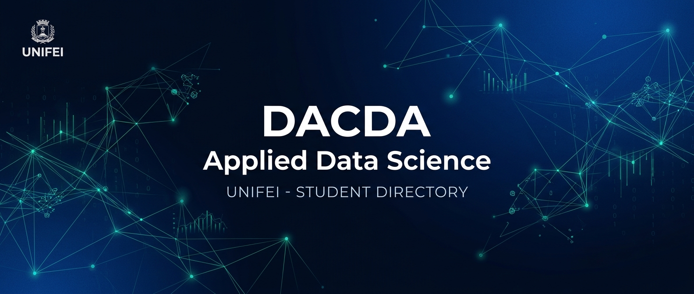

<p align="center">
  
</p>

<h1 align="center">DACDA • Base Documental Institucional</h1>

<p align="center">
  <strong>Diretório Acadêmico de Ciência de Dados Aplicada — Universidade Federal de Itajubá</strong>
</p>

<p align="center">
  <a href="https://dacda-unifei.github.io/dacda-documentos/"></a>
  <a href="docs/estatuto/estatuto-social.md"></a>
  <a href="docs/administrativo/transparencia.md"></a>
  <a href="CONTRIBUTING.md"></a>
</p>

<p align="center">
  <a href="https://dacda-unifei.github.io/dacda-documentos/"><strong>🌐 Acessar Portal de Documentação Interativo (GitHub Pages) »</strong></a>
</p>

<p align="center">
  <a href="#-apresentação">Apresentação</a> •
  <a href="#-estrutura-de-governança">Governança</a> •
  <a href="#-mapa-da-documentação">Documentação</a> •
  <a href="#-transparência-e-dados">Transparência</a> •
  <a href="#-como-contribuir">Contribuir</a>
</p>

---

## 🏛️ Apresentação

Este repositório é a central pública oficial de **minutas, modelos normativos, planejamento estratégico e prestação de contas** do **Diretório Acadêmico de Ciência de Dados Aplicada (DACDA)** da **UNIFEI**.

Seu propósito é assegurar:
- **Continuidade institucional:** Preservação de histórico e transições de gestão organizadas;
- **Democracia e representatividade:** Acesso irrestrito de qualquer estudante aos atos do DA;
- **Transparência ativa:** Escrituração contábil aberta e prestação de contas periódica;
- **Governança colaborativa:** Discussão de propostas via issues e pull requests.

> ⚠️ **Aviso Jurídico:** Os documentos normativos deste repositório são **minutas e modelos de trabalho**. Antes de qualquer registro em cartório, protocolo ou uso oficial, o conteúdo deve ser revisado e homologado pelos órgãos competentes da UNIFEI e por assessoria jurídica habilitada.

---

## 🧭 Estrutura de Governança do DACDA

O modelo de governança estudantil do DACDA é estruturado de forma colegiada e horizontal:

```
                      ┌─────────────────────────┐
                      │    ASSEMBLEIA GERAL     │
                      │  (Instância Deliberativa│
                      │     Máxima Discente)    │
                      └────────────┬────────────┘
                                   │
         ┌─────────────────────────┴─────────────────────────┐
         ▼                                                   ▼
┌─────────────────────────┐                         ┌─────────────────┐
│   DIRETORIA EXECUTIVA   │◄─────── Fiscalização ───│ CONSELHO FISCAL │
│   • Coordenação Geral   │                         │ (Controle       │
│   • Secretaria / Docs   │                         │  Financeiro     │
│   • Finanças            │                         │  Independente)  │
│   • Comunicação & Mídia │                         └─────────────────┘
│   • Projetos & Eventos  │
└────────────┬────────────┘
             │
             ▼
┌─────────────────────────────────────────────────────────────┐
│                    COMISSÕES TEMÁTICAS                      │
│   • Acadêmica & Pedagógica  • Infraestrutura Computacional  │
│   • Diversidade & Inclusão  • Relações com o Mercado & Ex.  │
└─────────────────────────────────────────────────────────────┘
```

---

## 📑 Mapa da Documentação

<table>
<tr>
<td width="50%" valign="top">

### 📜 Estatuto e Normas
Diretrizes fundamentais da entidade:

- 📄 **[Estatuto Social](docs/estatuto/estatuto-social.md)**  
  *11 capítulos e 27 artigos: objetivos, associados, assembleias e eleições.*
- ⚖️ **[Regimento Interno](docs/estatuto/regimento-interno.md)**  
  *Funcionamento da diretoria, rotinas operacionais e sucessão.*
- 📝 **[Ata de Fundação](docs/estatuto/ata-de-fundacao.md)**  
  *Modelo de ata constitutiva para criação formal da entidade.*

</td>
<td width="50%" valign="top">

### 📊 Planejamento Estratégico
Gestão orientada a resultados e metas públicas:

- 🎯 **[Plano de Ação](docs/planejamento/plano-de-acao.md)**  
  *Matriz 5W2H distribuída em 7 eixos estratégicos de atuação.*
- 📅 **[Cronograma de Marcos](docs/planejamento/cronograma.md)**  
  *Marcos temporais (semanas, meses) para entregas discentes.*
- 📈 **[Metas e Indicadores (KPIs)](docs/planejamento/metas-e-indicadores.md)**  
  *Indicadores de transparência, participação e comunicação.*

</td>
</tr>
<tr>
<td width="50%" valign="top">

### 🏛️ Administrativo e Compliance
Transparência fiscal e conduta ética:

- 🔍 **[Política de Transparência](docs/administrativo/transparencia.md)**  
  *Fluxo de publicação em 4 etapas e critérios de divulgação.*
- 💰 **[Prestação de Contas](docs/administrativo/prestacao-de-contas.md)**  
  *Modelo de balancete discriminado de receitas e despesas.*
- 🛡️ **[Políticas Internas](docs/administrativo/politicas-internas.md)**  
  *Prevenção de conflito de interesses, patrimônio e privacidade.*

</td>
<td width="50%" valign="top">

### 📣 Comunicação Institucional
Manual de marca e relação com a universidade:

- 🎨 **[Identidade Visual](docs/comunicacao/identidade-visual.md)**  
  *Paleta institucional, regras tipográficas e uso do brasão.*
- 📢 **[Comunicados Oficiais](docs/comunicacao/comunicados-oficiais.md)**  
  *4 modelos: editais de assembleia, notas públicas e ofícios.*

</td>
</tr>
</table>

---

## 🗃️ Pastas de Registros Contínuos

| Pasta | Finalidade | Regra de Publicação |
|:------|:-----------|:--------------------|
| 📜 **[Atas](atas/README.md)** | Registros de reuniões de diretoria e assembleias gerais | Anonimização mandatória de CPFs e assinaturas |
| 💵 **[Financeiro](financeiro/README.md)** | Balancetes periódicos e prestação de contas aprovada | Parecer vinculante do Conselho Fiscal |
| 🚀 **[Projetos](projetos/README.md)** | Fichas técnicas de iniciativas, grupos de estudo e extensão | Alinhamento com o Plano de Ação |
| 🖼️ **[Assets](assets/README.md)** | Vetores, logos e artes oficiais de divulgação | Apenas arquivos com direitos autorais cedidos |

---

## 🛡️ Princípios de Transparência e LGPD

1. **Acesso Público Total:** Todos os documentos normativos e balancetes contábeis são públicos por padrão.
2. **Proteção Estrita de Dados Pessoais (LGPD):** É terminantemente proibida a publicação de números de CPF, RG, endereços residenciais, telefones privados ou dados bancários pessoais.
3. **Anonimização de Listas:** Listas de presença e relatos discentes devem utilizar marcadores `[DADO ANONIMIZADO]`.
4. **Revisão Colegiada Prévia:** Nenhum documento entra no branch `main` sem revisão por membros designados.

---

## 🤝 Como Contribuir

Toda a comunidade discente do curso de Ciência de Dados Aplicada da UNIFEI é incentivada a propor melhorias:

1. **Abra uma Issue:** Descreva o contexto, o objetivo e o documento a ser ajustado (use os templates do repositório);
2. **Crie uma Branch:** Padrão `tipo/tema-curto` (ex.: `docs/ajuste-regimento-interno`);
3. **Desenvolva a Proposta:** Escreva em português claro, mantendo tags `[PREENCHER]` quando houver dados pendentes;
4. **Submeta o Pull Request:** Descreva as mudanças para análise da comissão responsável.

Consulte os detalhes em [CONTRIBUTING.md](CONTRIBUTING.md) e o nosso [Código de Conduta](CODE_OF_CONDUCT.md).

---

<p align="center">
  <sub><strong>Diretório Acadêmico de Ciência de Dados Aplicada (DACDA)</strong><br>Universidade Federal de Itajubá — Campus Itajubá / Itabira</sub>
</p>
